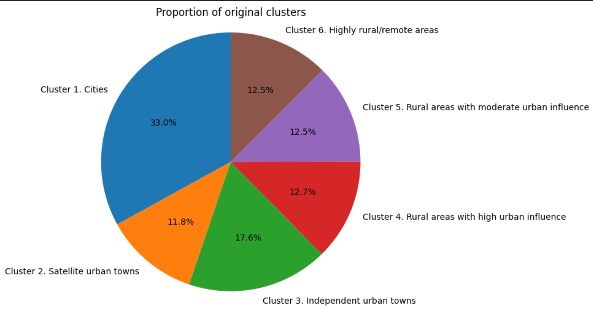
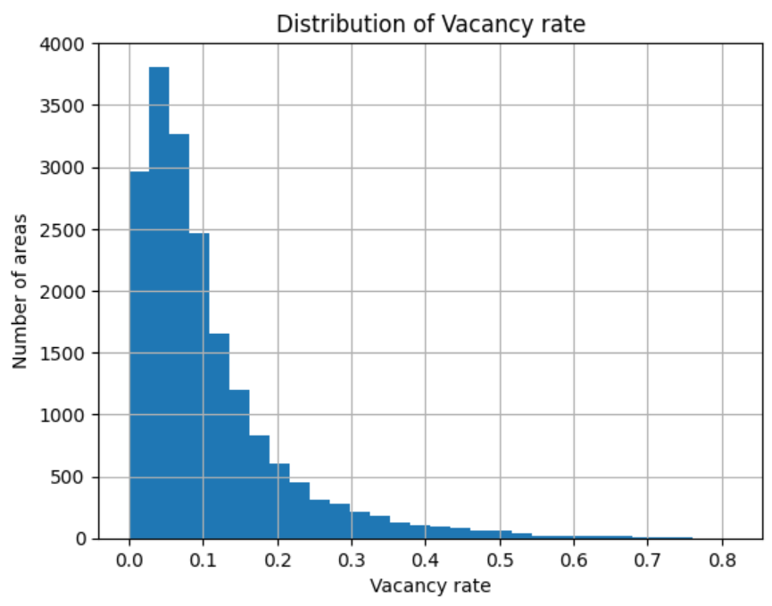
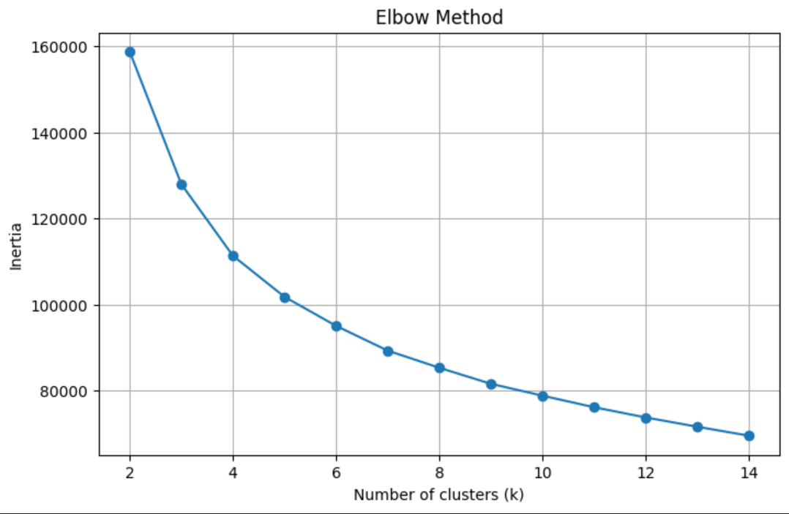
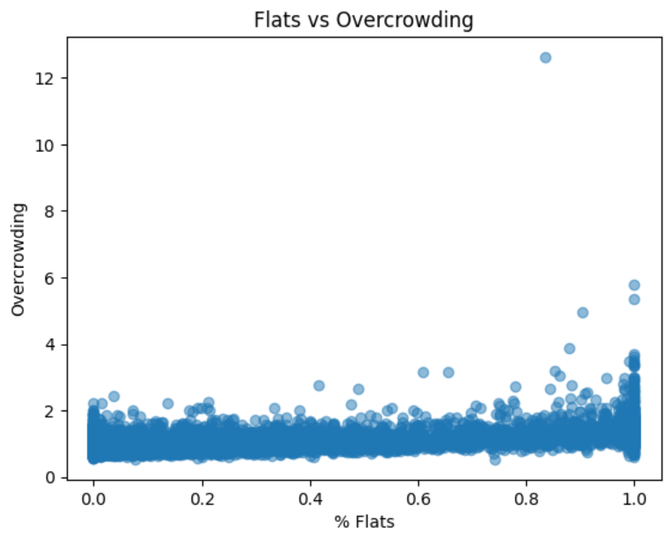
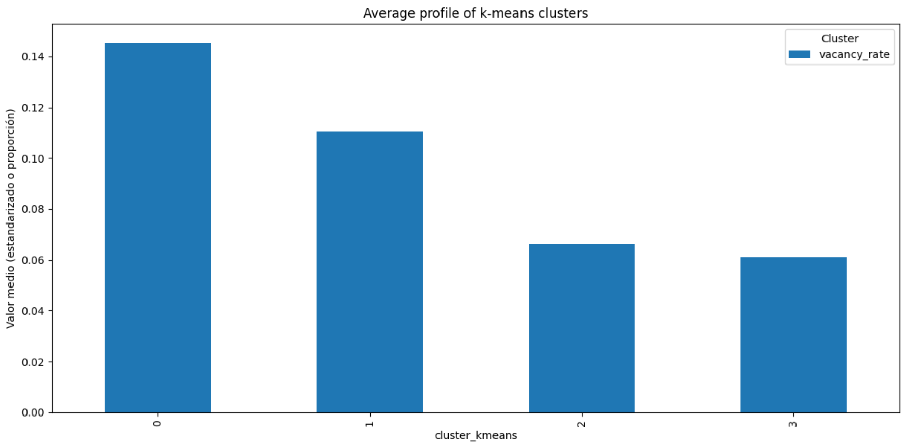
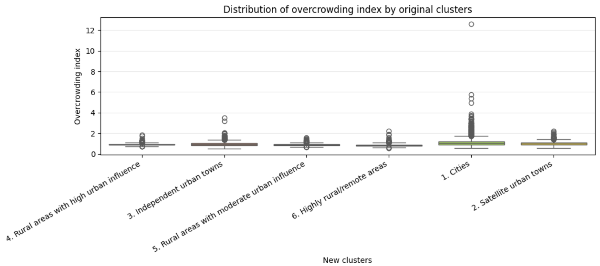
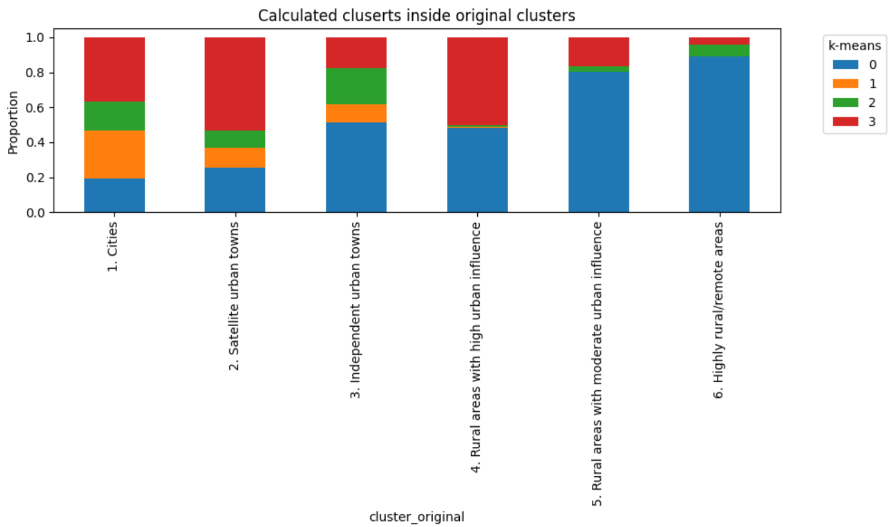
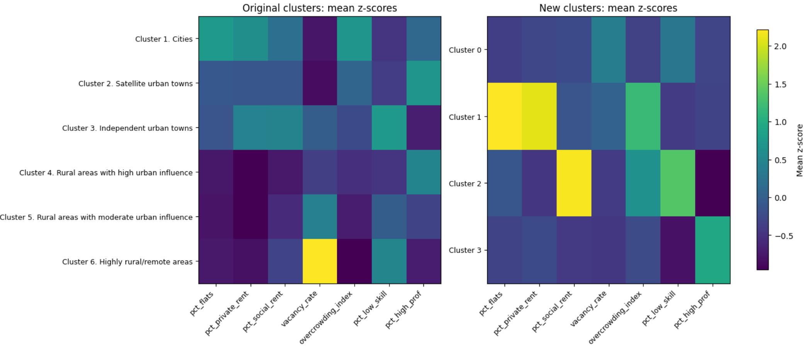

# 🏠 Housing and Social Inequality in Ireland  
### K-Means Clustering on Census 2022 Data

## 📌 Project Summary

Machine learning project analysing housing pressure and socio-economic inequality across Ireland using K-Means clustering.

Focuses on uncovering hidden territorial patterns beyond traditional urban–rural classifications.

---

## 🛠️ Technologies

Python · Pandas · NumPy · Scikit-learn · Matplotlib · Seaborn · Jupyter

---

## 📊 Key Results

- Identified **4 socio-economic clusters**
- Revealed inequalities not captured by official classifications
- Highlighted housing pressure beyond urban areas

---

## 📊 Visualisations

### 🔹 1. Exploratory Data Analysis (EDA)

#### Distribution of key variables


#### Overcrowding by original classification


---

### 🔹 2. Model Selection

#### Elbow Method


---

### 🔹 3. Clustering Results

#### Cluster formation


#### Cluster distribution


---

### 🔹 4. Interpretation

#### Overcrowding by cluster


#### Original vs ML clusters


---

### 🔹 5. Feature Relationships

#### Feature scatter


#### Cluster heatmap


---

## ▶️ How to Run

### 1. Clone the repository
```bash
git clone https://github.com/Granades/housing-inequality-ireland-ml.git
cd housing-inequality-ireland-ml

## ▶️ How to Run

### 1. Clone the repository

```bash
git clone https://github.com/Granades/housing-inequality-ireland-ml.git
cd housing-inequality-ireland-ml

### 2. Install dependencies

pip install pandas numpy scikit-learn matplotlib seaborn jupyter

### 3. Run the notebook

jupyter notebook
