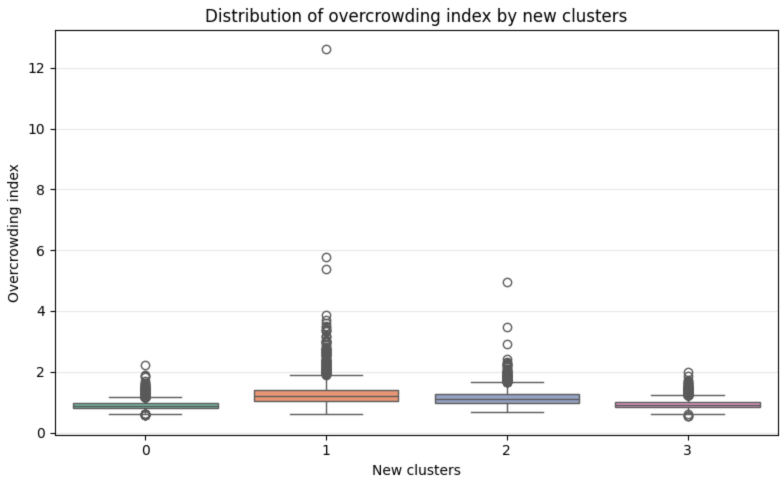

# 🏠 Housing and Social Inequality in Ireland  
### K-Means Clustering on Census 2022 Data

## 📌 Overview

Machine learning project analysing housing pressure and socio-economic inequality across Ireland using Census 2022 data (~19,000 small areas).

The project applies **K-Means clustering (K = 4)** to identify hidden territorial patterns beyond traditional urban–rural classifications.

---

## 🧠 What this project does

The main analysis is implemented in:

👉 `housing_clustering_analysis.ipynb`

Inside the notebook, you will find:

- Data loading and cleaning  
- Feature selection (11 variables)  
- Data standardisation (Z-score)  
- K-Means clustering  
- Elbow method for model selection  
- Visualisation and interpretation of clusters  

---

## ⚙️ Machine Learning Approach

- **Type:** Unsupervised Learning  
- **Algorithm:** K-Means Clustering  
- **Goal:** Discover hidden socio-economic structures  

### Pipeline:

1. Data preprocessing  
2. Feature scaling  
3. Model selection (Elbow Method)  
4. Clustering (K = 4)  
5. Interpretation of clusters  

## 📊 Visualisations

### 🔹 1. Exploratory Data Analysis (EDA)

#### Distribution of key variables


#### Overcrowding by original classification


---

### 🔹 2. Model Selection

#### Elbow Method


---

### 🔹 3. Clustering Results

#### Cluster formation


#### Cluster distribution


---

### 🔹 4. Interpretation

#### Overcrowding by cluster


#### Original vs ML clusters


---

### 🔹 5. Feature Relationships

#### Feature scatter


#### Cluster heatmap


---

## ▶️ How to Run

### 1. Clone the repository
```bash
git clone https://github.com/Granades/housing-inequality-ireland-ml.git
cd housing-inequality-ireland-ml

## ▶️ How to Run

### 1. Clone the repository


git clone https://github.com/Granades/housing-inequality-ireland-ml.git
cd housing-inequality-ireland-ml

### 2. Install dependencies

pip install pandas numpy scikit-learn matplotlib seaborn jupyter

### 3. Run the notebook

jupyter notebook
